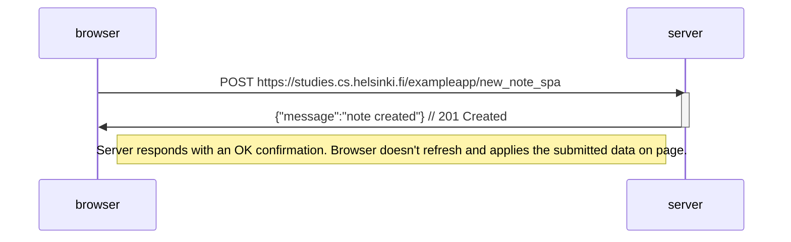

```mermaid
    sequenceDiagram
        participant browser
        participant server

        browser->>server: POST https://studies.cs.helsinki.fi/exampleapp/new_note_spa
        activate server
        server->>browser: {"message":"note created"} // 201 Created
        deactivate server

        Note right of browser: Server responds with an OK confirmation. Browser doesn't refresh and applies the submitted data on page.
```